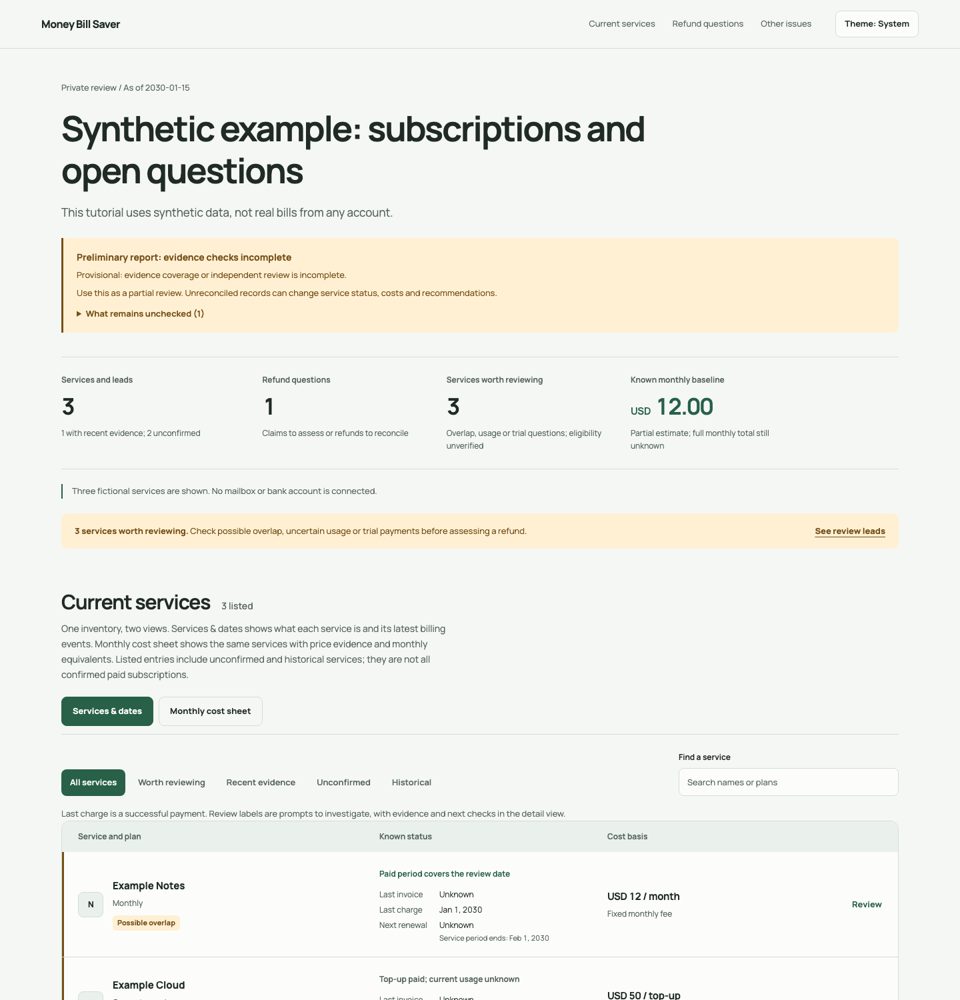

# Money Bill Saver

[](https://skills.sh/WellyXY/money-bill-saver)

**Know what you pay for, spot charges worth questioning, and draft refund requests—from your bills and subscription emails.**

[50-second illustrated quickstart](docs/quickstart.md) · [Interactive demo](https://wellyxy.github.io/money-bill-saver/) · [Open example report](https://wellyxy.github.io/money-bill-saver/example-report.html) · [MIT license](LICENSE)

## Install in one command

Run in your terminal (requires Node.js and Git):

```sh
npx --yes skills add WellyXY/money-bill-saver --skill money-bill-saver --agent codex --global --yes
```

[](https://wellyxy.github.io/money-bill-saver/example-report.html)

*Example report with fictional services and amounts. Your audit produces a private webpage.*

**You get:** your service list and monthly cost sheet → refund questions with evidence → next steps and support drafts. Refunds are not guaranteed; requests are sent only with your authorization.

## Try it in Codex

Then open a new Codex task and try it:

```text
Use $money-bill-saver to render and explain the bundled synthetic example report. Do not access my mailbox or personal files.
```

Prefer installing from chat? Paste this request into Codex:

```text
$skill-installer Install the money-bill-saver skill from https://github.com/WellyXY/money-bill-saver/tree/main/skills/money-bill-saver
```

Open a new task after installation; restart Codex if the skill does not appear. The [illustrated quickstart](docs/quickstart.md) walks through your first report.

For your own review, attach the bills you choose or specify an authorized mailbox and date range. A mailbox review needs a mail connector available in your host; this skill does not bundle one. Installing it does not grant account access.

**Version: v0.8.2 / Stage 0 · [MIT](LICENSE)**

Reports, interface copy, exports and repository documentation default to **English** unless another language is requested. The [interactive demo](https://wellyxy.github.io/money-bill-saver/) uses synthetic data and can be paused, replayed or navigated with a keyboard.

## What the audit delivers

Every audit webpage contains three sections in this order:

| Section | Contents |
|---|---|
| **Current services** | One inventory with Services & dates and Monthly cost sheet views. Every observed or user-named service retains its plan, supported status, three billing dates, cost basis and review labels. Search and filters apply to both views. |
| **Refund questions** | A visible queue of overlap, usage and trial-payment leads, followed by separately counted specific refund cases. Specific cases include their basis, amount under review, eligibility state, missing evidence and next step. |
| **Other issues** | Renewal decisions, unknown prices, usage checks, missing benefits, reimbursements, dependencies and source gaps. |

Empty sections remain visible. A refund question does not mean a refund has been approved or is guaranteed. Normal and resolved services remain in the inventory.

The inventory count includes uncertain and historical entries; it is not a count of confirmed paid subscriptions. The cost sheet uses the same service list. Its full-inventory baseline stays unchanged when a display filter hides rows.

### From a review lead to a refund request

| Signal | First check | Possible next action |
|---|---|---|
| Similar services | Compare actual workflows, required features and recent use; verify both paid plans | Keep both, consolidate or investigate an unwanted paid period |
| Old records or usage unknown | Check activity for a stated period and current billing; ask for the user's usage context | Keep, downgrade, cancel a future renewal, or assess a past charge |
| Trial may have become paid | Match the trial notice to a settled charge, plan and cancellation history | Explain the charge or assess a supported refund/goodwill request |

Missing update emails do not establish non-use, continued billing or refund eligibility. A gap in selected evidence is not proof that no later messages exist. Review leads are highlighted in both inventory views, carry a specific next check and do not add a refundable amount. A claim needs its own charge, period, usage or discrepancy evidence and applicable seller terms. User-reported non-use can support an honestly attributed goodwill request; it does not establish an entitlement.

The document includes source timelines, issue details, official support routes and copyable local drafts where appropriate. Manage/both audits show a known monthly baseline with its components and unresolved prices or usage. Supporting JSON and CSV exports retain the evidence model and invoice checks. The webpage is the primary result; a Markdown report can provide additional detail.

## Review coverage

| Bill or situation | Review focus |
|---|---|
| Software, media, tools and memberships | Fixed prices, annual billing, price changes, expired promotions, non-use and overlapping services |
| Cloud, API, telecom and utilities | Rates, usage, seats, allowances, overages and service periods |
| Trials and automatic renewals | Trial and renewal dates, notices, usage, cancellation history and refund conditions |
| App-store and payment-platform purchases | Merchant of record, transaction status and the applicable refund channel |
| One-time purchases and services | Quote differences, itemization, delivery and correction or refund evidence |
| Missing paid or promised benefits | Feature access, credits, service periods, restoration and compensation conditions |

The common workflow applies across merchants in the supplied evidence. Railway is one optional merchant reference, not the scope of the skill.

Non-use triggers a separate refund assessment. Eligibility depends on the purchase channel, dates, applicable terms and evidence. A clearly attributed goodwill request can be appropriate when entitlement is not established. Cancelling future renewal and requesting a past-charge refund remain separate actions.

## Workflow

1. Discover services from bills, receipts and welcome, plan, trial, renewal and cancellation notices. Keep services named by the user even when no receipt is found.
2. Classify invoices, settled receipts, payment attempts, estimates, credits and incoming reimbursements before calculating totals.
3. Follow later events for the same account and transaction. A newer payment or plan confirmation can change an earlier conclusion while the full timeline remains available.
4. Check invoice arithmetic, identity, service periods, rates, usage and potential duplicate payments. Record evidence gaps explicitly.
5. Assess usage and service dependencies, then prepare a supported correction, refund, benefit-restoration or future-cost decision.
6. Apply the bundled design guidance and render the three-section webpage with evidence, actions and local drafts.
7. Submit requests or change settings only within the user's separate authorization and the host's actual tool capabilities. Preserve receipts and verify outcomes.

## Completion checks before the first report

Mailbox reviews default to the last **six calendar months**, unless you request another period. Start with billing channels, then use targeted sender/account/thread checks for cancellations, refunds and plan or payment changes. Read the selected query pages and relevant messages/attachments. Automatic brand-wide searches are off; unresolved questions stay visible for a separate follow-up. Annual plans without a notice in the selected period may be absent.

New audits retain an `audit-evidence.json` manifest with the declared scope, actual search results, message dispositions and attachment coverage. Another reviewer checks the original evidence against the proposed report. The review is bound to the full report, its service/case rows and evidence content so edits to summaries, costs or sources require a new review.

The executable gate checks scoped search coverage, selected pagination, unreviewed records, attachment coverage, review findings and stale bindings. Focused billing/lifecycle searches satisfy coverage; an unrestricted merchant pass is not required. The renderer recomputes the result instead of trusting a supplied `checked` flag. Follow the [evidence contract](skills/money-bill-saver/references/audit-evidence-contract.md):

```sh
python skills/money-bill-saver/scripts/check_audit.py \
  --report dashboard.json --evidence audit-evidence.json --output audit-checks.json
python skills/money-bill-saver/scripts/render_dashboard.py \
  --input dashboard.json --evidence audit-evidence.json \
  --require-checked --output dashboard.html
```

An incomplete audit can still be rendered as a clearly labeled preliminary report by omitting `--require-checked`. Without a manifest, legacy reports and examples are preliminary by default. A completed check applies to the declared source scope; facts and refund conditions absent from that scope remain unknown. The gate cannot independently judge every extraction or authenticate the reviewer's identity, so original-source review remains part of the workflow.

## Install and use

Use the [one-command installation above](#install-in-one-command) or the [Codex chat installer](#try-it-in-codex). For a local manual installation, copy this repository's [`skills/money-bill-saver`](skills/money-bill-saver) directory into a [Codex user skill location](https://learn.chatgpt.com/docs/build-skills#where-codex-loads-local-skills), such as `~/.agents/skills/`. Update an existing installation by replacing the same skill directory.

For the optional Codex plugin package, add this repository as a marketplace source and install the preview plugin:

```sh
codex plugin marketplace add WellyXY/money-bill-saver
codex plugin add money-bill-saver@money-bill-saver
```

This GitHub marketplace is a testing source. It is separate from the public ChatGPT and Codex Plugins Directory, which requires [submission and review](https://developers.openai.com/plugins/deploy/submission).

Example request:

```text
Use $money-bill-saver to review all bills I supply or authorize you to read.
Investigate possible overcharges, duplicate payments, unused services,
unwanted renewals and missing benefits. Deliver an English offline webpage
with current services, refund questions and other issues, including costs,
evidence gaps, next steps and support drafts.
```

For a mailbox review, specify the account and date range and use an authorized mail tool available in the current environment. This skill does not bundle a Gmail or Outlook connector. Mail exports and invoice attachments also work. Incomplete source coverage is disclosed in the result.

Installing the skill alone does not authorize mailbox scanning. A service tool or existing login does not establish access to its invoices, usage or cancellation features.

## Context use and design guidance

`SKILL.md` is the core workflow. References are loaded at the relevant collection, analysis or reporting step; README is not an audit prerequisite. The [mailbox search checklist](skills/money-bill-saver/references/email-search-checklist.md) starts with payment channels, app stores, card alerts and trial notices, then checks related account events through targeted queries or the relevant thread within the selected scope.

Reports use the fixed template. Ordinary runs read the short [webpage preflight](skills/money-bill-saver/references/web-design.md) and only **Section 14: FINAL PRE-FLIGHT CHECK** of the bundled [design-taste-frontend guide](skills/money-bill-saver/references/design-taste-frontend/SKILL.md#14-final-pre-flight-check). Its landing-page and framework rules do not override financial evidence or trigger a redesign. The full guide remains available for an explicitly requested redesign.

The bundled guide is an unmodified copy of [Leonxlnx/taste-skill](https://github.com/Leonxlnx/taste-skill), retaining its [MIT notice](skills/money-bill-saver/references/design-taste-frontend/LICENSE). The Manrope font retains its [SIL Open Font License](skills/money-bill-saver/assets/fonts/OFL.txt). Original Money Bill Saver material is available under the repository's [MIT license](LICENSE).

## Local tools

The tools have been tested with Python 3.12. Invoice checks and webpage rendering use the Python standard library. PDF text extraction uses `pypdf` or an installed Poppler `pdftotext` executable. Raw email decoding uses the standard library and reuses the PDF extractor for PDF attachments.

Install the tested dependencies in an isolated environment:

```sh
python3 -m venv .venv
source .venv/bin/activate
python -m pip install -r requirements.txt
```

Check the synthetic invoice example:

```sh
mkdir -p work
python skills/money-bill-saver/scripts/check_facts.py \
  --input skills/money-bill-saver/assets/example-facts.json \
  --output work/example-checks.json
```

Extract a PDF supplied for the audit:

```sh
python skills/money-bill-saver/scripts/extract_pdf.py \
  /absolute/path/to/invoice.pdf --output-dir work/extracted
```

Decode a saved raw email and its attachments (Gmail RAW JSON or `.eml`):

```sh
python skills/money-bill-saver/scripts/extract_mime.py \
  /absolute/path/to/raw-message.json --output-dir work/mail --extract-pdf
```

The MIME output preserves the original response, decoded attachments and readable derivatives with integrity bindings. Source entries start unread; review them before including their conclusions in an audit. Keep the output bundle together when moving it, and use an output directory separate from the input files. Complete saved tool results are supported; truncated previews must be retrieved again rather than treated as complete messages.

Render the synthetic webpage example:

```sh
python skills/money-bill-saver/scripts/render_dashboard.py \
  --input skills/money-bill-saver/assets/example-dashboard.json \
  --output work/dashboard.html
```

All five tools support `--help`; replacing existing output requires `--force`. The examples are synthetic and do not represent a real account. `work/` is excluded from version control. Keep real bills, messages, account mappings and audit outputs in a private working directory.

## Cost and evidence semantics

- Unknown prices remain unknown, not zero or public list prices.
- Fixed monthly prices, variable usage, prepaid balances, annual or multi-month equivalents and historical invoice totals are separate quantities.
- Fixed monthly subtotals include only source-supported, explicitly selected monthly prices and are separated by currency. They do not represent complete spending.
- A known monthly baseline separately normalizes current account-specific prices, plan bases and valid prepaid terms. Its component calculation and cost gaps remain visible; it is not actual cash paid this month, complete spend or a guaranteed minimum.
- A reconciled invoice proves arithmetic consistency, not payment, appropriate metering or refund eligibility.
- Failed payment notices, duplicate documents and pending authorizations do not establish duplicate settled charges.
- An old receipt, a product announcement or absence of a cancellation email does not establish a currently active paid subscription.
- Disabled auto-renew can coexist with a valid prepaid service term.
- Cash refunds, credit awards, waived unpaid bills, restored benefits and estimated savings remain separate outcomes. Historical results do not become newly recovered money.

## Output and privacy

`dashboard.html` contains its data, styles and scripts. System fonts or embedded font data keep the document self-contained. It does not load remote fonts, images, analytics or trackers; evidence and support links are followed only when the user chooses to open them.

Rendering the webpage does not send messages, submit disputes or change accounts. Copying a draft is not submission. Real audit webpages and evidence should remain private and must not be committed to this public repository.

The local helper scripts make no network requests. Evidence read by the assistant may still be processed by the model provider configured in the host; local execution does not imply local-only model processing.

Original source text and identifiers are preserved. English summaries or translations do not replace source evidence. Another report language can be requested explicitly.

## Validation

```sh
python -m pip install -r requirements-dev.txt
python -m unittest discover -s tests/money-bill-saver -p 'test_*.py'
```

The synthetic test suite covers decimal arithmetic, document identity and duplicate observations, incomplete or conflicting records, PDF extraction and damaged-text warnings, raw MIME decoding (attachments, legacy charsets, encrypted or mislabeled PDFs, size limits), varied billing cycles, cross-merchant cases, safe webpage data embedding, monthly subtotal boundaries and issue classification.

Completion-gate tests cover omitted localized search results, unfinished pagination, metadata-only messages, unread attachments, independent-review findings, other refund cases, changed reports and changed source files. MIME regressions cover truncated messages, inline invoice images, attached messages, HTML charset declarations, PDFs without file extensions, portable PDF manifests, and failed output replacement. Original responses and readable derivatives are checked for modification or omission. These tests verify the gate's behavior; they do not replace factual review of real documents.

Browser and visual checks are separate from these automated tests. Use the host's permitted checks to verify the rendered document and report only checks that were actually performed.

## v0.8.2

- `scripts/extract_mime.py` decodes saved raw messages into a full MIME payload, hashed attachments, HTML/CSV text (including Big5) and PDF page text, with suggested evidence entries.
- The workflow now probes mail tools for a raw single-message format before declaring an attachment unreadable, and falls back to user uploads, connected folders or an authorized browser session.
- The evidence contract documents how converted messages and part-ID attachments satisfy the completion gate.
- Raw conversion preserves originals and binds the files used for review; inline images and attached messages remain in the evidence inventory. Truncated MIME is rejected, legacy HTML encoding warnings remain visible, PDF references survive moving the bundle, and failed replacements preserve previous output and source files.

## v0.8.1

- Renamed the repository, Skill folder, invocation and report brand to Money Bill Saver (`money-bill-saver`).
- Existing installations should use the new folder and invocation shown above.

## v0.8.0

- Merchant/provider discovery and later lifecycle reconciliation before missing-evidence conclusions.
- Executable coverage and independent-review gate, including raw search pagination and MIME attachment checks.
- Final rendering rejects incomplete checks; preliminary results display unresolved checks.
- Review bindings detect changes to service/case rows, overall costs and summaries, or underlying evidence after review.

## v0.7.0

- One inventory with status/date and monthly-cost tabs, shared filters and explicit count semantics.
- Visible review labels for functional overlap, uncertain usage and possible trial conversion.
- A proactive review queue with evidence limits and concrete next checks, separate from specific refund cases and money totals.
- Guarded signal data, valid peer references and independent service/signal counts.

## v0.6.1

- All services appear in a clear cost sheet with price evidence, billing basis, monthly equivalent and inclusion status.
- Expandable notes retain cost uncertainties and evidence.
- Requested Excel workbooks can be delivered privately and linked from the webpage after verification.

## v0.6.0

- Monthly cost summaries show a sourced known baseline, counted components and unresolved costs.
- Current prices and prepaid terms normalize by their covered months, with exact arithmetic, separate currencies and half-up total rounding.
- Unknown prices stay outside the sums; actual cash payments, waivers, credits, usage and the fixed monthly subtotal retain separate meanings.

## v0.5.0

- Known status now always shows Last invoice, Last charge and Next renewal on desktop and mobile.
- Each date retains its source, precision and status; unknown dates remain explicit.
- Renewal dates are separate from term end, expiry, manual-renewal requirements and failed payment attempts.
- Existing inputs receive unknown dates rather than dates guessed from free text.

## v0.4.0

- English defaults for reports, interface text, exports, examples and repository documentation, with explicit language overrides.
- Introduced a full portable copy of `design-taste-frontend`. Ordinary audits now read only its preflight section; see [Context use and design guidance](#context-use-and-design-guidance).
- Audit-specific design integration that preserves the complete financial inventory, three-section structure, private data and offline delivery.
- Refined page presentation with theme, responsive-layout and interaction guidance while retaining the existing evidence and cost boundaries.

## Capability limits

Codex performs reading, source research, usage interpretation and drafting. The helpers extract text, check invoice consistency and render sourced presentation data; they do not independently determine refund eligibility.

Scanned PDFs or complex layouts may require visual inspection or OCR. Extraction warnings identify unexpected control characters and preserve the original text for cross-checking; the helper does not guess missing characters or guarantee that every PDF can be parsed.

Mailbox discovery can be incomplete, and a current service inventory may require account pages, bank statements, app-store receipts or other billing accounts. These gaps must stay visible. The audit does not promise refunds, claim unverified non-use or silently cancel services.

## Reference files

- [Skill entry point](skills/money-bill-saver/SKILL.md)
- [Common billing review](skills/money-bill-saver/references/billing-review.md)
- [Facts and outcomes contract](skills/money-bill-saver/references/facts-contract.md)
- [Deliverables](skills/money-bill-saver/references/deliverables.md)
- [Dashboard data contract](skills/money-bill-saver/references/dashboard-contract.md)
- [Evidence and completion gate contract](skills/money-bill-saver/references/audit-evidence-contract.md)
- [Web design integration](skills/money-bill-saver/references/web-design.md)
- [Bundled design skill](skills/money-bill-saver/references/design-taste-frontend/SKILL.md)
